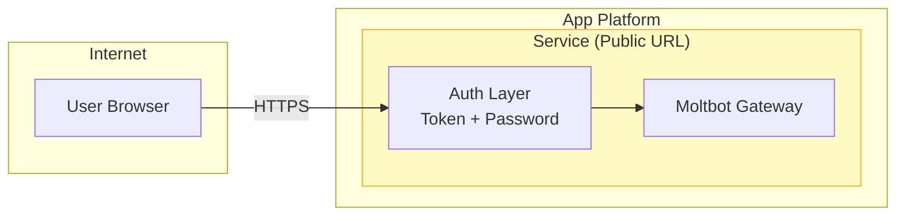
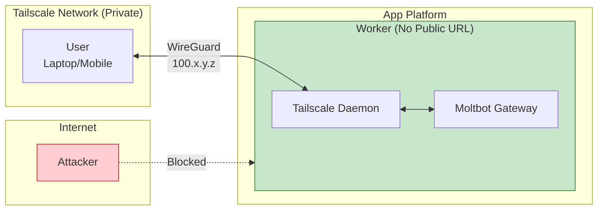
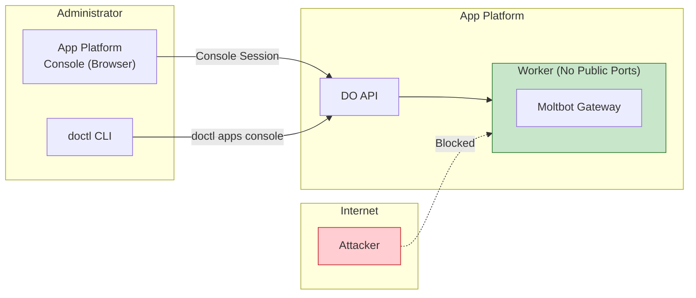
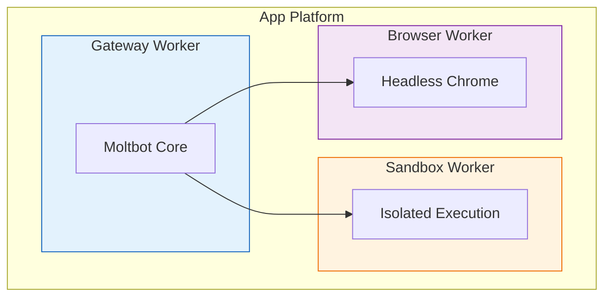

# Moltbot - App Platform Rollout

## Experience & Architecture

Three deployment options with different security/convenience tradeoffs:

### Option A: Service with Strong Authentication
**Public endpoint, protected by token + password**



**Experience:** Deploy via button or CLI → Set token + password + Spaces credentials + Gradient API key → Gateway boots → Access UI via App Platform URL → Configure channels from browser.

---

### Option B: Private Service with Tailscale
**No public endpoint, accessible only via Tailscale network**



**Experience:** Deploy via button or CLI → Provide Tailscale auth key → Gateway boots and joins Tailnet → Access UI via Tailscale IP (100.x.y.z) from any device on your Tailnet → Configure channels from browser.

**Prerequisite:** Tailscale account with auth key.

---

### Option C: Private Worker with Console Access
**No public endpoint, access via App Platform Console (browser or CLI)**



**Experience:** Deploy via button or CLI → Pre-configure channels in app.yaml where possible → Gateway boots → Access via App Platform Console (browser) or `doctl apps console` (CLI) → Configure channels, scan WhatsApp QR via console browser.

**Note:** WhatsApp QR pairing works via App Platform browser console.

---

### Comparison

| Criteria | Option A (Service) | Option B (Tailscale) | Option C (Console) |
|----------|-------------------|---------------------|---------------------|
| **Public Exposure** | Yes (with auth) | No | No |
| **Browser/UI Access** | Yes (public URL) | Yes (via Tailnet) | Yes (via Console) |
| **WhatsApp Support** | Yes | Yes | Yes (via Console) |
| **Setup Complexity** | Low | Medium (need Tailscale) | Low |
| **Security** | Medium | High | High |
| **Mobile Access** | Yes (any browser) | Yes (Tailscale app) | No |
| **Best For** | Quick setup, mobile access | Production, full security | Simple private setup |

---

## Integrations

Once deployed, Moltbot supports 19+ channel integrations:

| Channel | Auth Method | Works With |
|---------|-------------|------------|
| Telegram | Bot token | A, B, C |
| Discord | Bot token | A, B, C |
| Slack | OAuth/token | A, B, C |
| WhatsApp | QR code scan | A, B, C |
| Matrix | Access token | A, B, C |
| Webchat | Built-in | A, B |

---

## How to Access & Test

### Repository

**GitHub:** https://github.com/digitalocean-labs/clawdbot-appplatform

| Branch | Option | Deploy |
|--------|--------|--------|
| `main` | A - Service | [](https://cloud.digitalocean.com/apps/new?repo=https://github.com/digitalocean-labs/clawdbot-appplatform/tree/main) |
| `tailscale` | B - Tailscale | [](https://cloud.digitalocean.com/apps/new?repo=https://github.com/digitalocean-labs/clawdbot-appplatform/tree/tailscale) |
| `worker` | C - Console | [](https://cloud.digitalocean.com/apps/new?repo=https://github.com/digitalocean-labs/clawdbot-appplatform/tree/worker) |

### CLI Deployment

```bash
# Option A - Service
doctl apps create --spec https://raw.githubusercontent.com/digitalocean-labs/clawdbot-appplatform/main/app.yaml

# Option B - Tailscale
doctl apps create --spec https://raw.githubusercontent.com/digitalocean-labs/clawdbot-appplatform/tailscale/app.yaml

# Option C - Worker
doctl apps create --spec https://raw.githubusercontent.com/digitalocean-labs/clawdbot-appplatform/worker/app.yaml
```

### Live Test Instance (Option A)

| | |
|---|---|
| **URL** | https://clawdbot-nxi3w.ondigitalocean.app/ |
| **Token** | `0qCXJ8Qk87CrgSrsaLl0OAfBKgA2nYFeEf01ZTfGoaQ=` |
| **Password** | `changeme123` |

---

## Open Items

### Security Review
- [ ] Security review of Option A (public endpoint with auth)
- [ ] Security review of Option B (Tailscale integration)
- [ ] Security review of Option C (worker mode)
- [ ] Penetration testing of auth layer

### Worker Mode Testing
- [ ] Validate worker deployment works end-to-end
- [ ] Test Tailscale userspace mode in App Platform containers
- [ ] Confirm no `NET_ADMIN` capability issues

### AI Assistant Integration
- [ ] Test deployment via App Platform Agent Skills from Claude Code
- [ ] Test deployment via Cursor
- [ ] Test deployment via Gemini
- [ ] Goal: Users can deploy and manage entirely from their AI assistant

### Tailscale Account
- [ ] Document Tailscale account creation steps
- [ ] Create reusable auth key instructions
- [ ] Consider Tailscale partnership for streamlined setup

### Auto-scaling
- [ ] Define scaling triggers and thresholds
- [ ] Test horizontal scaling behavior
- [ ] Document scaling recommendations

### Persistence (Litestream)
- [ ] Litestream is used and production-recommended for SQLite → Spaces backup
- [ ] **Risk:** Worst case, customer loses configuration and must restart
- [ ] **Mitigation:** Abstract all critical config into `app.yaml` so channel integrations are the only state at risk
- [ ] Document backup/restore procedures

---

## Next Steps

### Multi-Component Architecture (Next Week)

Current single-container architecture will evolve to production-ready multi-component:



### Sandboxing Alternatives

Moltbot uses Docker for sandboxing tool execution. On App Platform:

1. **Option:** Fork Moltbot to use App Platform sandboxes for session isolation
2. **Option:** Isolate by running gateway and backend in separate services
   - Data kept separate from agent execution
   - Configure tenant/connection isolation across gateways

### Production Blueprint

Target: Scalable production blueprint with:
- Multi-component isolation
- Tenant separation
- Horizontal scaling
- Disaster recovery

**ETA:** Next week

---

## References

- [Architecture Documentation](./APP-PLATFORM-ARCH.md)
- [Architecture Diagrams](./APP-PLATFORM-DIAGRAMS.md)
